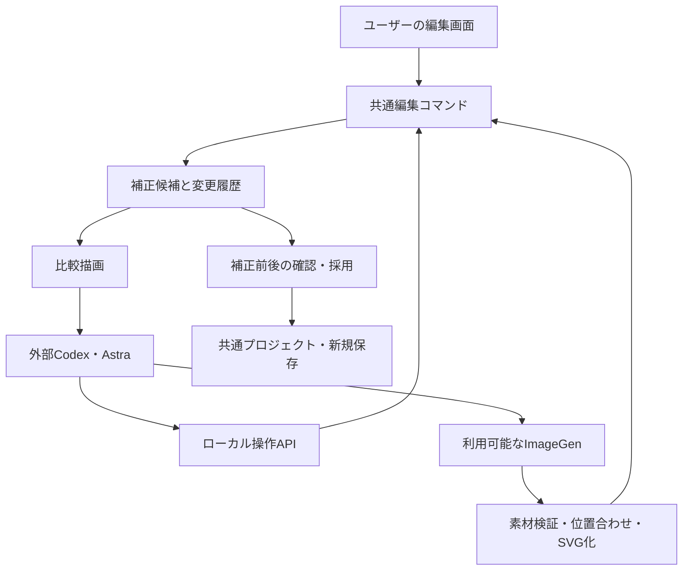

# SVG-Through Motion：AI補正プロトタイプ設計案

作成日：2026-09-09。設計提案の原記録。P0–P3の試作を実装済み。実際の範囲と設計との差は [実装・検証記録](ai-assist-p1-p3.md)、操作は [外部AIガイド](ai-assist-agent-guide.md) を参照。

## 1. 提案の中心

SVG-Through単体で、素材の読み込み・初期変換・手動編集・書き出しまで完結させる。その共通編集機能をAIにも公開し、必要な場合は画像生成による補正素材を取り込めるようにする。

ユーザーの入口は「自分で作る」「最初からAIに任せる」の2つ。「自分で作る」の仕上げに、任意で「AIに仕上げを頼む」を置く。AIの有無で保存形式や編集できる内容を分けない。

最初の実験対象は閉じ目・閉じ口。位置・形状の補正と、ImageGenで作った差分素材の取り込みを、同じ比較・採用手順で扱う。

## 2. ユーザー体験

| 入口 | 操作と結果 |
|---|---|
| 自分で作る | 現行の読み込みから編集・書き出しまで進む。AIとの接続なしで完了できる |
| AIに仕上げを頼む | 現在の編集状態から、目・口などの対象と「素材の生成も使う」を指定して補正を依頼する |
| 最初からAIに任せる | 素材を登録し、希望を伝える。AIが初期変換・点検・補正・結果提示まで進める |

両AI経路は共通の補正セッションに合流する。「仕上げ」は現在の編集状態から、「最初から」は素材登録から開始する点だけが異なる。

AIによる作業中は「目を確認中」「閉じ口の候補を作成中」など、制作上の進捗を表示する。「中断して自分で編集」は常時使える。終了時は補正前後の静止画と短い動き、変更点、未解決点を表示する。

試作ではセッション全体を1つの補正案として採用する。部位ごとの採否は、下地と目などの依存関係があるため後続とする。「適用」で現在の編集へ反映し、「別名保存」で新規出力する。内部では候補を自動評価して進められるため、途中の微調整ごとにユーザーへ確認しない。

## 3. 入力と範囲

最初から任せる場合も、現行と同じ「両目・口が開いた元画像＋対応する分離PSD」を入力とする。任意の1枚絵からのPSD分離まで含む意味ではない。既存の差分PSD入力も維持する。

| 試作に含める | 後続で検討する |
|---|---|
| 閉じ目・閉じ口の位置、幅、高さ、傾き調整 | 任意パスのノード編集・自由な描画 |
| 生成した線で対応しているカーブ・線幅の調整 | 任意SVGに対する輪郭の作り直し |
| 閉じ目・閉じ口のPNG/SVG候補取り込み | 顔下地の生成補修、髪・腕の描き足し |
| 開閉途中・動きの比較、取り消し、別保存 | 5母音一式、Live2D向け完全パーツ展開 |
| 外部Codexによる工程進行 | アプリ自身がクラウドAIを呼ぶ常駐エージェント |

下地の残像や素材の分離ミスは検出・報告対象に含めるが、試作の位置調整で無理に隠さない。必要なら手動修正へ戻し、未解決として提示する。

## 4. 現在の実装から再利用できるもの

| 既存の箇所 | 確認できた機能 | 必要な拡張 |
|---|---|---|
| `studio/control.py` | ローカルREST、操作受付・結果確認、編集画面との接続 | 編集状態取得、補正セッション、永続的な操作記録 |
| `web/app.js` / `web/studio-outputs.js` | 読込、設定変更、ポーズ、出力 | UIとAIが共有する編集コマンドへの切り出し |
| `web/eye-workbench.js` / `web/mouth-gizmo.js` | 形状調整、ドラッグ、局所的なUndo | コマンド単位の履歴と数値操作の共通化 |
| `web/eyelid-controls.js` / `web/mouth-controls.js` | 閉じ形の描画 | 編集可能な項目・単位・範囲を返すアダプター |
| `studio/face_donors.py` | PSDから顔差分のみ抽出、位置を保ったSVG化 | PNG差分、配置情報、候補としての取り込み |
| `web/canvas-renderer.js` / `web/assets.js` | 描画、SVG検証、素材の持ち出し | 指定状態の比較描画、素材検証の再利用 |

既存APIの`revision`はOBSへの公開回数であり、編集の競合検知には流用しない。現在の操作履歴はメモリ上で直近100件、サーバー再起動で消えるため、補正セッションの履歴は別に保存する。

## 5. 構成

AIがJSON全体やSVG全文を毎回読み書きする必要をなくし、部位のID・現在値・編集可能項目を取得して意図を指定できるようにする。画像は全体1枚と対象の拡大画像を基本にし、再確認は変更部位を中心に行う。

ImageGenの呼び出しは外部エージェント側が担当する。アプリのREST APIがCodex内蔵ImageGenを直接呼べるとは仮定しない。利用可能な契約・環境・ツールを接続時に確認し、モデル名だけで画像生成可否を決めない。

## 6. 接続と作業開始

試作の接続方法は、ローカルAPI＋既存Pythonクライアントの拡張とする。MCPラッパーはAPI契約が固まった後に追加できる。

1. アプリで素材と対象を選び、補正依頼を作る。
2. 「AIへの依頼をコピー」から、ローカルURL・依頼ID・希望をCodexへ渡す。既存の接続を確認できる場合は同じ依頼を利用する。
3. Codexが依頼を取得し、操作対象と利用可能機能を登録する。
4. アプリは受理を確認して「AI作業中」へ進む。依頼をコピーしただけでは接続済み表示にしない。

「最初から任せる」では、既存の素材登録結果を依頼に関連付け、変換開始・変換状態取得・結果読込までAPIから進められるようにする。編集画面が空の状態でも依頼と変換状況は取得できる必要がある。

接続には`can_inspect_images`、`can_edit_project`、`can_generate_images`を別々に持たせる。画像を確認できない接続では自動視覚補正を開始しない。生成機能がなければ数値調整で進め、素材生成が必要になった部位だけ未解決とする。

## 7. 操作契約案

以下は追加する概念上の操作名。既存の再生・OBS APIは維持し、補正用の`/api/assist`配下に追加する案とする。

| 操作 | 入力・出力の要点 |
|---|---|
| `inspect_project` | プロジェクトID、編集revision、キャンバス、部位ID、役割、素材種別、編集可能値・単位・範囲、ロック状態 |
| `start_session` | `finish` / `from_inputs`、入力または開始revision、対象、希望、生成利用、試行上限 |
| `render_review` | 候補revision、ポーズセット、表示範囲、背景。画像と描画条件のmanifestを返す |
| `apply_edit` | 候補ID、期待revision、対象ID、型付き操作、絶対値、操作ID。変更値と新revisionを返す |
| `prepare_asset_request` | 対象ID、用途。参照画像、対象範囲、マスク、座標情報をまとめて返す |
| `import_asset_candidate` | リクエストID、生成画像、配置情報。検証結果と仮素材IDを返す |
| `attach_asset_candidate` | 仮素材ID、対象スロット。候補へ差し込み、比較を要求する |
| `restore_candidate` | 過去revisionの状態を新revisionとして復元する |
| `finish_session` | 比較画像、変更内容、未解決点、最良候補を確定し、ユーザー確認へ進む |
| `cancel_session` | 実行世代を無効化し、途中の素材は候補として保持する |

編集操作は、例えば`set_closed_eye_transform`、`set_closed_mouth_transform`、`set_generated_contour`、`replace_closed_asset`とする。未知のフィールドを許す汎用JSONパッチは最初のAPIに含めない。

座標は原画キャンバス基準のpx（左上原点、右が+X、下が+Y）、角度は度、幅・高さは倍率を基本とする。内部で1024px換算などを使う項目はアダプターで変換し、AIへ返す単位を明示する。左右は名称だけに頼らず、安定した部位IDと枠を描いた確認画像で特定する。

画像由来の差分では位置・拡縮・回転のみ、生成線ではカーブなども編集可能と返す。対応しない形状編集を黙って無視しない。

## 8. 候補・競合・復旧

補正セッションは開始時の編集状態を固定し、独立した作業コピーで進める。ユーザーの現行プロジェクトへは採用時にだけ反映する。

- `project_revision`は手動・AIを問わず確定した編集ごとに増える。ドラッグは1操作として確定する。
- `candidate_revision`は候補編集ごとに増える。全変更は期待revisionを必須とし、不一致なら状態を取り直す。
- 操作IDは永続記録する。同じID・同じ内容の再送は既存結果を返し、同じIDで異なる内容は拒否する。
- AI作業中にユーザーが編集を再開するとAIを一時停止する。採用時に開始revisionと異なる場合は上書きせず、再評価または別プロジェクトとして保存する。
- Undoは履歴の削除ではなく、過去状態を新revisionとして復元する。採用したAI補正全体も1回のUndoで戻せるようにする。
- 停止・切断・再起動後に届いた生成結果は自動適用しない。セッション世代と素材ハッシュを照合し、候補として残す。

長時間の画像生成待ちは、既存の編集コマンド1件を実行中のまま保持しない。`waiting_asset`として保存してコマンドを解放し、結果取り込み時に続行する。外部ImageGenの実行そのものをアプリから停止できるとは仮定しない。

状態遷移：`awaiting_agent → preparing → reviewing → editing / waiting_asset → reviewing → ready_for_review → applied`。中断・切断は`paused / cancelled`、回復できない実行エラーは`failed`。`ready_for_review`と品質合格は別に扱う。

## 9. ImageGenから素材を戻す契約

リクエストには、元絵全体、周辺を含む対象crop、部位マスク、補正目的、変更してよい範囲、対象パーツID、元素材ハッシュを含める。マスクを直接入力できない生成ツールでは参照画像として渡し、厳密な適用範囲は取り込み側が管理する。

取り込みは「絵柄確認 → 位置合わせ → 必要範囲の抽出 → 透過化 → SVG化 → 組み込み確認」の順。生成結果はビットマップなので、編集可能なベジェ曲線がそのまま返るとは扱わない。線画化・SVG化による劣化も、生成PNGとの比較で確認する。

保持する情報：`request_id`、`source_hash`、`candidate_revision`、`target_part_id`、`target_slot`、`canvas_size`、`crop_rect`、`output_size`、`output_to_canvas`変換、`application_mask`、生成指示、結果ハッシュ。

生成画像の寸法が同じでも、内容の位置が一致する保証はない。周辺の特徴で位置を確認し、試作では平行移動・均等拡縮・回転までを許す。合わせられなければ採用しない。透過PNGも透明度を検証し、白背景を自動で透明と解釈しない。

閉じ目・閉じ口は許可されたスロットだけ交換する。元画像と他パーツは保持し、比較は必要領域だけでなく顔全体でも行う。既存のキャッシュ・境界情報などは影響対象に応じて更新し、描画完了前に成功を返さない。

OpenAI公式資料でも、画像編集のマスクは厳密な形状維持を保証しないとされている。したがって、プロンプトによる範囲指定に加えて、取り込み時の切り抜き・配置・比較が必要になる。

## 10. 比較と終了条件

確認画像は候補の固定スナップショットから描画する。ライブの音声、カメラ、再生時刻、画面タブの状態から独立させ、現在の編集画面のポーズを副作用で変えない。

標準セットは通常顔、閉眼率0/50/80/100%（口固定）、口開度0/25/50/100%（目固定）、両方を閉じた状態、待機モーション8時点。顔の拡大と全体を出し、背景は明色・暗色を切り替える。blinkの内部数値規約は変換し、画像のラベルを「閉眼率」として統一する。

同じ条件の補正前・補正後を並べ、目尻の位置、残る白目、口内の残像、閉じ形への切替の跳び、絵柄の違いをAIが確認する。元絵との差分値だけで採点しない。閉眼画像は元の開眼画像と異なって当然だからである。

決定的に検査できる項目は、設定範囲、素材形式、対象外素材のハッシュ、許可外の変更、開閉状態の描画可否、出力読込など。境界の自然さや表情は画像による所見を記録する。

提案する初期上限は、対象ごとの数値補正3周、セッション全体の画像生成2呼び出し（呼び出し開始・結果・失敗を記録）、レビュー再開時も回数を引き継ぐ。改善しない場合は最良候補を残して終了する。厳密なトークン数は取得できる環境だけ記録し、取れなければ不明とする。これらの値は実測で見直す。

## 11. 保存と既存出力

保存先案はプロジェクト内の`data/assist/<session-id>/`。初期状態、revision履歴、候補素材、比較画像、所見、操作結果を分けて保存し、原素材は参照とハッシュで共有する。採用済みの出力は従来どおり新規IDへ保存する。

持ち出し用プロジェクトは採用済み素材を内包し、補正セッションやAIへの接続なしで再編集・再出力できるようにする。内部用の履歴は任意添付とし、巨大な比較画像を通常保存へ毎回重複させない。

保存物には容量上限を設け、既存の空き容量ガードも通す。自動削除は行わない。具体的な生成容量は試験で測り、母艦のストレージポリシーに従って制限を決める。

ローカルAPIは既存のlocalhost・Origin検証を維持する。補正操作を選択したプロジェクトとセッションに限定し、素材の入力はアップロードまたは登録済みIDで行う。AIから任意のファイルパスへの書き込みを要求できるAPIにはしない。SVGは既存の入力検証を経由する。

## 12. 実装順序と完了基準

| 段階 | 実装するもの | 完了基準 |
|---|---|---|
| P0：共通編集と比較 | 状態取得、形状編集コマンド、候補、revision、Undo、固定条件描画 | AIなしでUIとコマンドの結果が一致し、往復・復元・別保存ができる |
| P1：AIによる補正 | 仕上げ依頼、外部Codexの接続、視覚レビュー、補正上限、結果表示 | 少なくとも位置ずれ・幅ずれの試験で、比較から補正・採用まで完了できる |
| P2：生成素材の往復 | 素材依頼、PNG取り込み、配置・抽出・SVG化・差分交換 | 閉じ口または閉じ目1部位で、実際のImageGen出力を取り込み開閉確認できる |
| P3：最初からお任せ | 素材登録済み状態から変換開始・監視・読込・共通補正へ接続 | 同じ素材を2つのAI入口で処理し、同じ編集・保存機能へ到達できる |

P0は単体利用の改善として独立して提供できる。2つのAI入口とImageGen連携を備えたプロトタイプ全体の完成はP3までとし、P1だけで全体完成とは扱わない。

変更箇所案：`web/edit-commands.js`（共通編集）、`web/review-renderer.js`（比較描画）、`web/assist-ui.js`（依頼と結果）、`studio/assist.py`（APIと状態）、`studio/assist_store.py`（履歴）、`studio/assist_assets.py`（素材取り込み）。名称は仮。既存編集UIを共通コマンドへ順次接続し、描画ロジックは再利用する。

## 13. 評価実験

同じ素材・同じ開始状態を、AIなし／AI調整のみ／AI調整＋ImageGenの3条件で比較する。例として、明瞭な線、前髪が目に重なる、斜め顔、柔らかい塗り、複雑な口内の5素材を固定する。対応PSDを用意できるユーザー素材を選び、素材選定は実装後の試験開始時に行う。

測る項目は、ユーザーの実作業時間、全体の経過時間、補正回数、生成回数、取得可能ならAI消費量、採用率、残る不具合。比較の提示順は入れ替え、ユーザーが「使える」「少し直せば使える」「使えない」で判定する。5素材は探索的評価であり、一般的な品質保証にはしない。

技術検証では、手動操作とAPI操作の一致、範囲外入力、古いrevision、同じ操作の再送、切断・再起動、生成中断後の遅延結果、位置の異なる素材、対象外パーツ保持、Undo後の復元を確認する。出力は保存JSONの再読込、PNG、アニメーションSVG、OBS反映を代表素材で確認し、未確認の出力経路は明記する。

採用判断は「ユーザーの修正時間が減り、元の表情や絵柄を保てるか」。改善が確認できない素材ではAI補正を採用せず、通常編集を継続できることも成功条件とする。

## 14. 推奨する着手点

P0のうち、閉じ目・閉じ口について「現在値を読む → 絶対値で変更 → 固定条件で描画 → 元に戻す」の縦断経路を先に作る。続いて仕上げ依頼と実際のAIレビューを接続し、最小の閉じ口素材1件でImageGen往復を検証する。

これにより、人間が操作してもAIが操作しても同じ結果になる基盤から、2つのAI入口と生成補正へ段階的に進められる。

## 参照

- [現行README](../README.md)
- [現行操作API](../studio/control.py)
- [既存の顔差分取り込み](../studio/face_donors.py)
- [既存の目の直接編集](../web/eye-workbench.js)
- [既存の口の形状操作](../web/mouth-gizmo.js)
- [OpenAI公式：画像生成・編集](https://developers.openai.com/api/docs/guides/image-generation#edit-an-image-using-a-mask)（前段の調査で確認。API仕様がCodex内蔵ツールの呼び出し契約と同一とは仮定しない）
